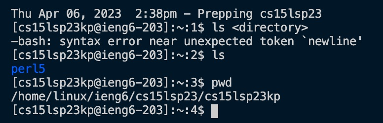

# LAB REPORT 1

## **Welcome to my page! :)**

My name is *Khoi Nguyen* 
Incoming CSE15L and even my future-self: welcome to 15L! This blog post will detail steps to get you started for the course!

## **Part 1**
*First we will be setting up your course-specific account for CSE15L and resetting the password this specific course account* 
   - Step 1: To get started, click the link below: 
              [Your CSE15L Account](https://sdacs.ucsd.edu/~icc/index.php)          
   - Step 2: Once you have signed in, follow the instructions on the following link! 
              [Tutorial: HOW TO RESET YOUR CSE15L PASSWORD](https://drive.google.com/file/d/17IDZn8Qq7Q0RkYMxdiIR0o6HJ3B5YqSW/view)  
              
*Things To Keep In Mind* 
1. A problem I ran into was that I clicked "UC San Diego Active Directory (AD) Password Change Tool" rather than selecting the specific course. If you do this, you will end up changing the password for your entire UCSD student account. We only want to change the password for this specific course account so pay attention! (See imagine below)   
3. Save your newly created password in a safe place! You will be needing it later on! 
4. If you’ve reset and you’re waiting a few minutes for it to take effect, feel free to start working on later sections of the lab. 

## **Part 2**
*Installing Visual Studio Code* 
    - Step 1: Click the following link to install VSCode: 
              [Visual Studio Code Link](https://code.visualstudio.com/) 
              Follow the instructions on the website to install. Be sure to download the VSCode version for your respective operating system (macOS for Macs and Windows for PCs)           
    - Step 2: Run and open your VSCode. You should see something like this: 
               
              
## **Part 3**
*Using Terminal via VSCode*
To preface, it is important to understand that we will be using the course student account in the terminal. In turn, all of the files will be on this account as well. The following instructions will help us understand how to log into a course-specific account on ieng6. 
     - Step 1: On the very top of the screen where the menu and page toolbar is located. Select "Terminal" tab then select "New Terminal".  This will open a terminal where you will work on.     
     - Step 2: Type in: 
     
     ssh *your_CSE15L_username*@ieng6.ucsd.edu
 
 
*Note that if you do not remember your CSE15L account username, it can be found on [Your CSE15L Account](https://sdacs.ucsd.edu/~icc/index.php)  Refer to the image below* 
 
     - Step 3: You will see a message that looks like: 
      
     This occurs because this is likely the first time you’ve connected to this server. Type in 'yes' and press enter. 
     - Step 4: Afterwards type in your NEW password that you created when you resetted your password. 
     *Remember to use the password for your CSE15L course specifc account and NOT your UCSD SSO password* 
      
     **PRO TIP!** There will be no signifer (such as asterisks) to indicate if you are typing in your password or not. Do not be alarmed. I recommend typing your password out on a different page such as the Notes app and copy and paste it over. 
     - Step 5: After you have completed these steps, you should see this:  If you see this message, congratulations! You have successfully logged in and now ready to try some commands :D 
     
## **Part 4**
*Running commands on the terminal* 
     - Below are a list of some useful commands to try out: 
     
     - pwd - Find the path of your current working directory.
     - cd - To navigate through the Linux files and directories, use the cd command.
            Depending on your current working directory, it requires either the full path or the directory name.
     - ls - The ls command lists files and directories within a system.
            Running it without a flag or parameter will show the current working directory’s content.
     - cat - Concatenate, or cat, is one of the most frequently used Linux commands.
             It lists, combines, and writes file content to the standard output. 
             To run the cat command, type cat followed by the file name and its extension.
 
    
 To explore more commands, here's a list of some basic commands: [40 Essential Linux Commands That Every User Should Know](https://www.hostinger.com/tutorials/linux-commands) 
 
  
 *Above is a screenshot of some commands that I have tried. As you can see I first used the 'ls' command and it listed some files and directories on the account. Then I used the 'pwd' command and it printed the path of my current working directory which is 'home/linux/ieng6/cs15lsp23/cs15lsp23kp* 
 
 <pr> In summary, we logged into the specific course account and resetted the password. From there we installed VScode, remotely connecting in terminal and connected to the correct server, and tried some commands. This blog posts goes beyond the scope of just instructions. Here I added some tips and addressed some issues that I, and my groupmates, have encountered.</pr>

     

              

